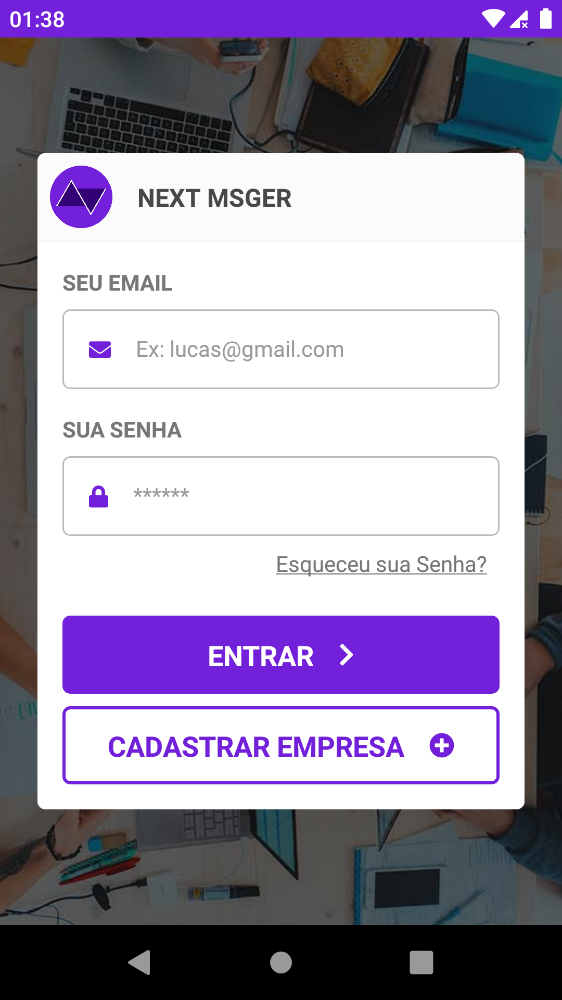

  

<h1 style="text-align: center">Next Msger</h1>

  

  

  

   

  

    
    
    
    
    
    
    
    
    
And much more...

---

## :page_with_curl: About The App

This app helps your company to send messages to your customers after finalize a service. This simple action could increase your sales, the customers satisfaction upon your products and grant that they will buy from you again.

## :pushpin: About The Project

This project was made to complete the [Fatec Americana](http://www.fatec.edu.br/) Software Analysis and Development course.

The mentor of the project was [Kléber de Oliveira Andrade](https://github.com/kleberandrade), an excellent teacher that helped us in the development process and in the documentation.

---

Made with ♥ by Luan Eduardo da Costa | [Follow me on Linkedin](https://www.linkedin.com/in/luaneducosta/)
